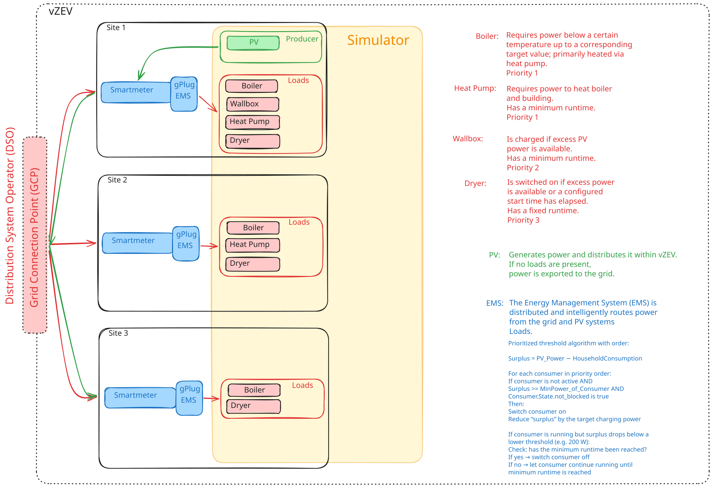

# vZEV System

This **vZEV System** combines several **Energy Management Systems (EMS)** running locally on [gPlug devices](https://gplug.ch/) that distributes available renewable energy across **multiple physical sites** in a virtual energy community. Sites share a common grid connection point (GCP), are in the same LAN and the EMS intelligently routes surplus PV energy to loads before it is exported to the grid.



## System overview

The system connects multiple **Sites** (buildings) under a single grid operator connection. Each site has:

- A **Smartmeter** — measures grid import/export at the site
- A **gPlug device** running **EMS** firmware — the local controller (ESP32 / Tasmota Berry)
- **Loads** — controllable consumers
- optional **Producers** — energy sources (PV panels, battery)

A **Simulator** (highlighted in yellow in the diagram) runs alongside a site for testing and demonstration without physical devices.

## Sites and loads

Each site can have a combination of the following loads, managed by priority:

| Load                         | Priority | Description                                                                                    |
| ---------------------------- | -------- | ---------------------------------------------------------------------------------------------- |
| **Boiler**                   | 1        | Heats water below a threshold temperature up to a target value; primarily heated via heat pump |
| **Heat pump**    | 1        | Heats boiler and building; has a minimum runtime                                               |
| **Wallbox**  | 2        | Charges if PV surplus is available; has a minimum runtime                                      |
| **Dryer**          | 3        | Switches on if surplus is available or a configured start time has passed; has a fixed runtime |

## EMS allocation algorithm

The EMS runs a **priority-based threshold algorithm** every second on the device
(`ems/backend/ems.be`):

```
Surplus = PV_Power − Household_Consumption

For each load in priority order:
  if load is inactive AND Surplus ≥ load.min_power AND load is not blocked:
    → activate load
    → reduce Surplus by the target power of the load

  if load is running AND Surplus drops below a lower threshold (e.g. 200 W):
    → check if minimum runtime has been reached
       yes → deactivate load
       no  → keep running until minimum runtime is reached
```

## PV producer

Each site can have zero, one or more PV systems. Surplus power is distributed to loads locally first, then into the vZEV; anything remaining is exported to the grid.

## Where computation happens

The gPlug is an ESP32-C3 with a very small Berry heap, so the device does only
what *must* run on hardware. Everything derived — roll-ups, money, the vZEV
energy allocation — is computed in the browser from raw data the device serves.

**On the device (`ems/backend/`):**

| Computation | Where | Why on device |
| ----------- | ----- | ------------- |
| Load allocation (priority sort, greedy activation, 200 W hysteresis, minimum runtime) | `ems.be` | Drives the relays; must run without a browser |
| Energy integration — samples grid / PV / active loads every 10 s, accumulates `W × dt / 3600` into Wh, seals a record at each 15-min boundary | `meter.be` | Needs continuous sampling |
| Raw record storage — delta encoding, per-day bucket files, retention pruning (30 days own slots, 14 days vZEV peer slots) | `store.be`, `vzev.be` | Local persistence; every write is an append, files are never rewritten |
| Unit conversion of integration readings (kW → W) | `integrations/` | Normalises vendor data at the source |

**In the browser (`ems/frontend/`):**

| Computation | Where |
| ----------- | ----- |
| Day / month roll-ups, energy costs in CHF | `src/lib/aggregate.js` |
| vZEV per-slot allocation, flow bucketing, quarterly billing | `src/lib/vzev.js` |
| History archive in IndexedDB, incremental sync, gap detection, CSV export/import | `src/lib/archive.js` |
| Smart-meter labelling, grouping and derived values | `src/lib/metercat.js` |
| All `site.json` configuration validation | `src/pages/einstellungen.js` |

The device APIs are correspondingly plain: `GET /api/energy?res=15m` streams raw
Wh records, `GET /api/vzev/raw` streams the producer id, the community tariffs
and every member's raw `ts,imp,exp` triples, and `GET /api/meter` returns the
Tasmota smart-meter sensor object verbatim. None of them compute a total, a
share or a price.

## Repository components

| Component              | Path                  | Description                                                                               |
| ---------------------- | --------------------- | ----------------------------------------------------------------------------------------- |
| **EMS backend**        | `ems/backend/`        | Tasmota Berry scripting backend, packaged as a `.tapp` app running on ESP32 gPlug devices |
| **EMS frontend**       | `ems/frontend/`       | Preact web UI; the `.tapp` ships an `index.html` shell, the bundle is served from a CDN   |
| **Simulator backend**  | `simulator/backend/`  | Spring Boot 4 / Kotlin backend that simulates loads and PV output                         |
| **Simulator frontend** | `simulator/frontend/` | React 19 + Vite UI for controlling the simulator                                          |

See the `CLAUDE.md` files in each component directory for commands and detailed architecture.

## Grid connection

All sites connect through a shared **Netzverknüpfungspunkt /NVP (GCP)** managed by the grid operator (**Verteilnetzbetreiber / VNB (DSO)**). The EMS coordinates across sites via UDP multicast so that the combined community behaves as a single energy-sharing unit.
